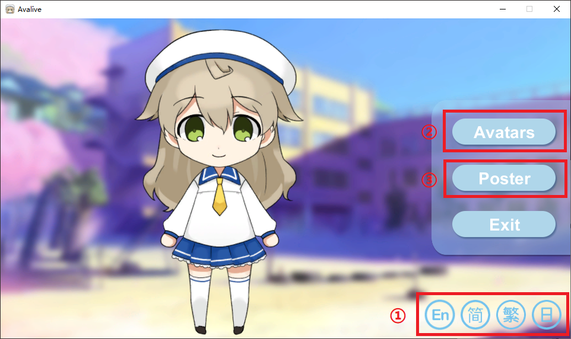
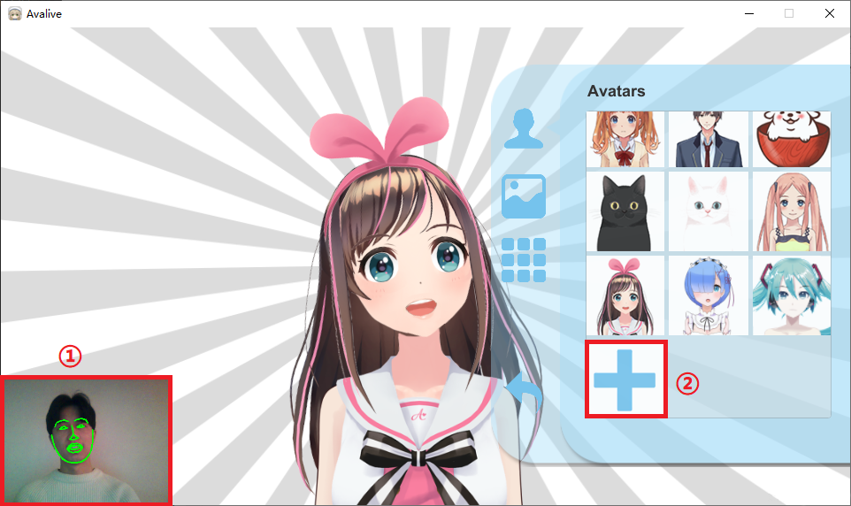
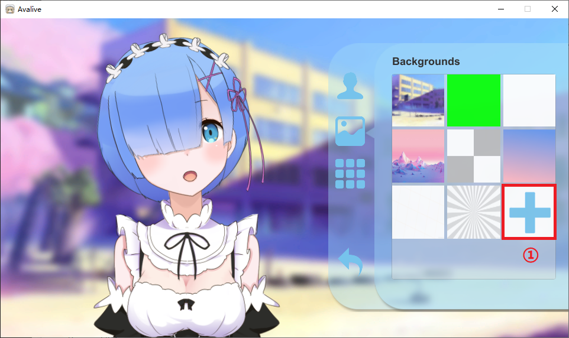
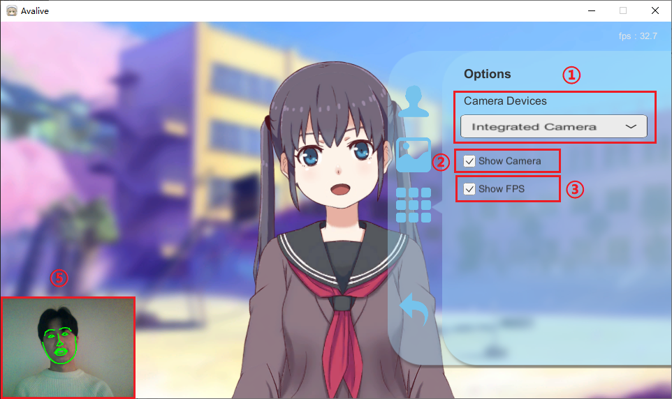
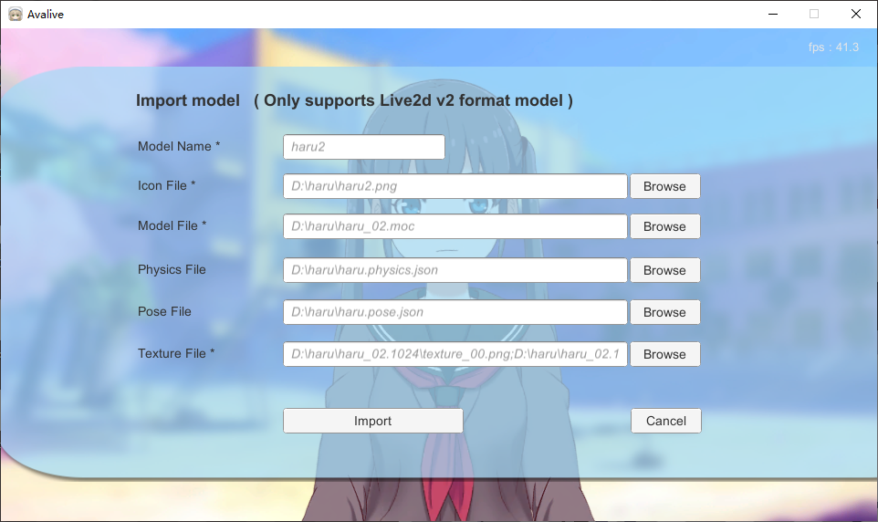
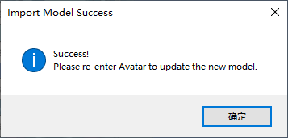
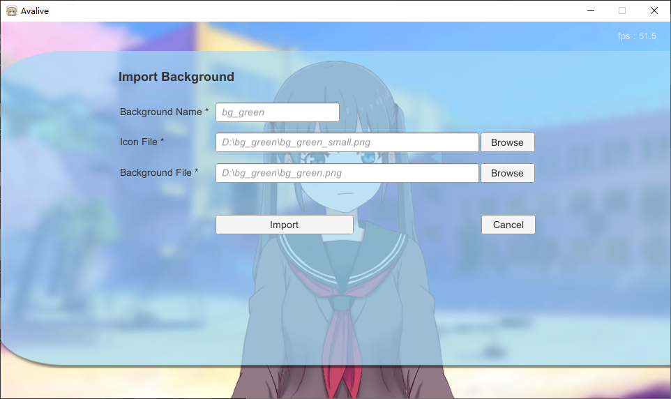
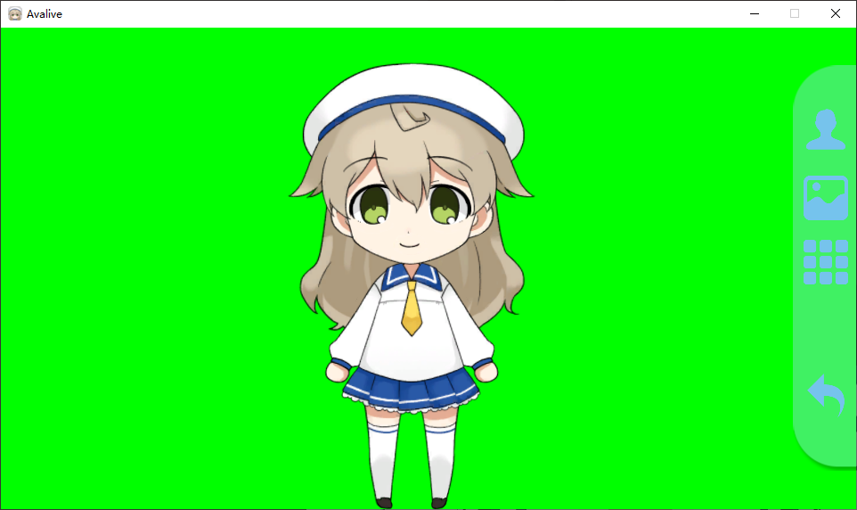

# User Documentation

## Usage

### Start

Start Avalive and you can see this scene

* ① Change language
* ② You can role play a avatar and become a VTuber
* ③ A Yuru-chara with a mouse interaction

### Avatars

#### Avatar Models

You can use the webcam to capture your facial expressions, like ①, Avatar model will do the same expressions, like the Kizuna AI.

You can also click the Add button ② to import custom models. Currently only Live2d version 2 models are supported.

#### Avatar Backgrounds

The backgrounds can also add a custom picture (png, jpg, jpeg) background, like ①.

#### Avatar Options

In Options, you can switch the camera ①, set the camera image ② and FPS ③ display.

All models, backgrounds, and user configurations are synchronized via the Steam Cloud.

#### Avatar Import Model

You can import **Live2d version 2** models.

Files marked with **an asterisk ( * )** are required. **Physical and pose files without an asterisk ( * ) can be empty**.

The **icon file** is a button icon displayed in avatars.

You can **select multiple texture files**, and each path is separated by a semicolon ( ; ) .

This prompt appears when you import the model successfully.

Then you need to return to the start scene (changing the language) and **re-enter the Avatars scene** to see the model you imported.

#### Avatar Import Background

Importing the background is similar to importing the model, all the files with **asterisks ( * ) are required**.

### Poster

This is a Yuru-chara, you can use mouse interaction, it can mouse tracking, lip tracking, automatic breathing, automatic blink.

