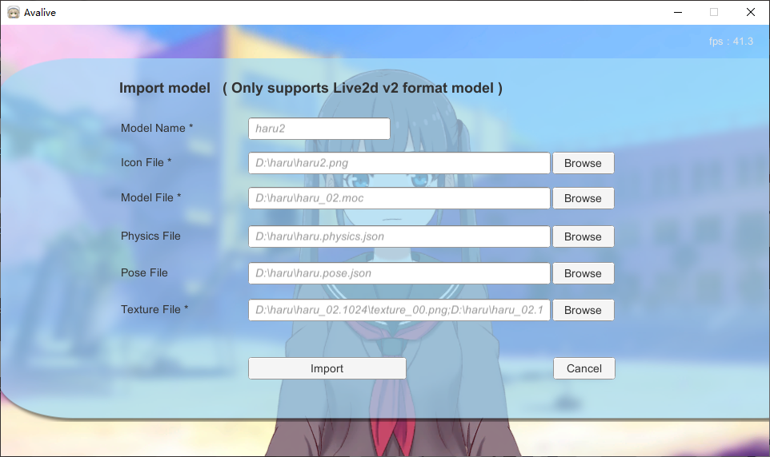
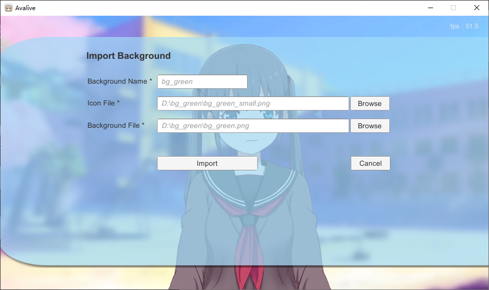

# 用户文档

## 使用指南

### 开始

启动 Avalive 会看到这个界面

* ① 更换语言
* ② 你可以扮演虚拟形象，成为 VTuber、Vuper、虚拟主播
* ③ 一个鼠标交互的看板娘

### 虚拟形象

#### 虚拟形象模型

你可以使用网络摄像头捕获你的面部表情，像①，模型将会做同样的表情，像这个爱酱。

你也可以点击添加按钮 ② 来导入自定义的模型，现在只支持 Live2d v2 格式的模型。

#### 虚拟形象背景

你也可以添加 ① 自定义的图片（png, jpg, jpeg）作为 Avalive 的背景。

#### 虚拟形象选项

在选项中，你可以切换摄像头 ①，设置摄像头画面 ② 与 FPS ③ 是否显示。

所有模型、背景和用户配置都可以通过 Steam 云进行同步。

#### 导入模型

你可以导入 **Live2d v2** 版本的模型

带**星号（ * ）的文件必填**，不带星号（ * ）的物理、姿势文件选填。

**图标文件**是虚拟形象中的模型按钮。

你可以**选择多个纹理文件**，每个纹理文件以英文分号（ ; ）分隔开。

一旦你导入模型成功，就会出现导入成功的通知。

然后你需要退出到（选择语言的）开始界面，**重新进入虚拟形象场景**才会显示你刚刚导入的模型。

#### 导入背景

导入背景与导入模型相似，带星号（*）的所有文件都是必填。

### 看板娘

你可以使用鼠标与看板娘交互，它可以做鼠标跟踪、唇形模仿、呼吸运动、自动眨眼。

