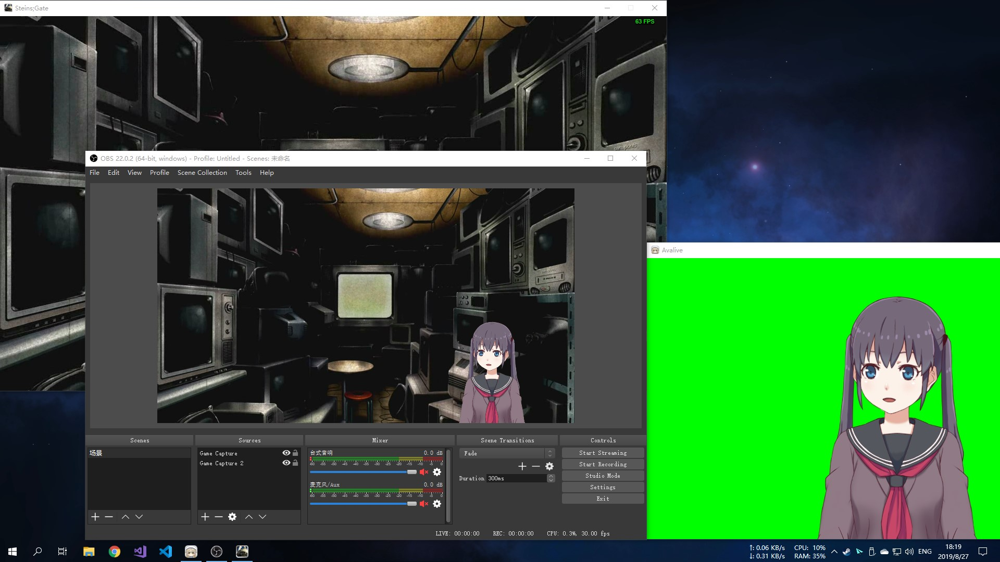
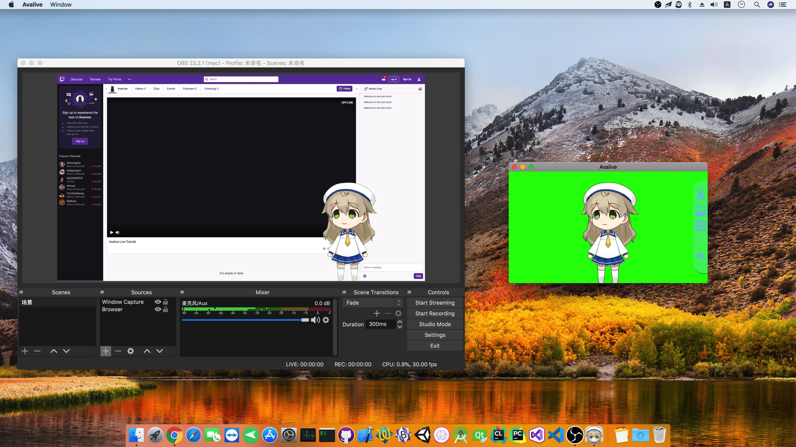

# Avalive

<table>
    <tr>
        <td>
            
        </td>
        <td>
            
        </td>
        <td>
            
        </td>
    </tr>
</table>

[English](README.md) | 简体中文 | [繁體中文](README_zh-Hant.md) | [日本語](README_ja.md)

## 简介

Avalive 是一个虚拟形象角色扮演软件。它可以通过摄像头让虚拟形象的表情和你的表情实时同步，从而让你扮演虚拟角色。你可以使用它进行直播、创作视频和动漫等等。

## 用户文档

[English](Doc/UserDocumentation.md) | [简体中文](Doc/UserDocumentation_zh-Hans.md)

## 视频

### Avalive 介绍

### Avalive 直播教程

## 截图

